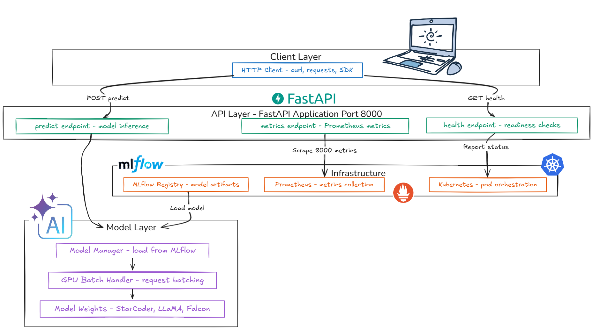
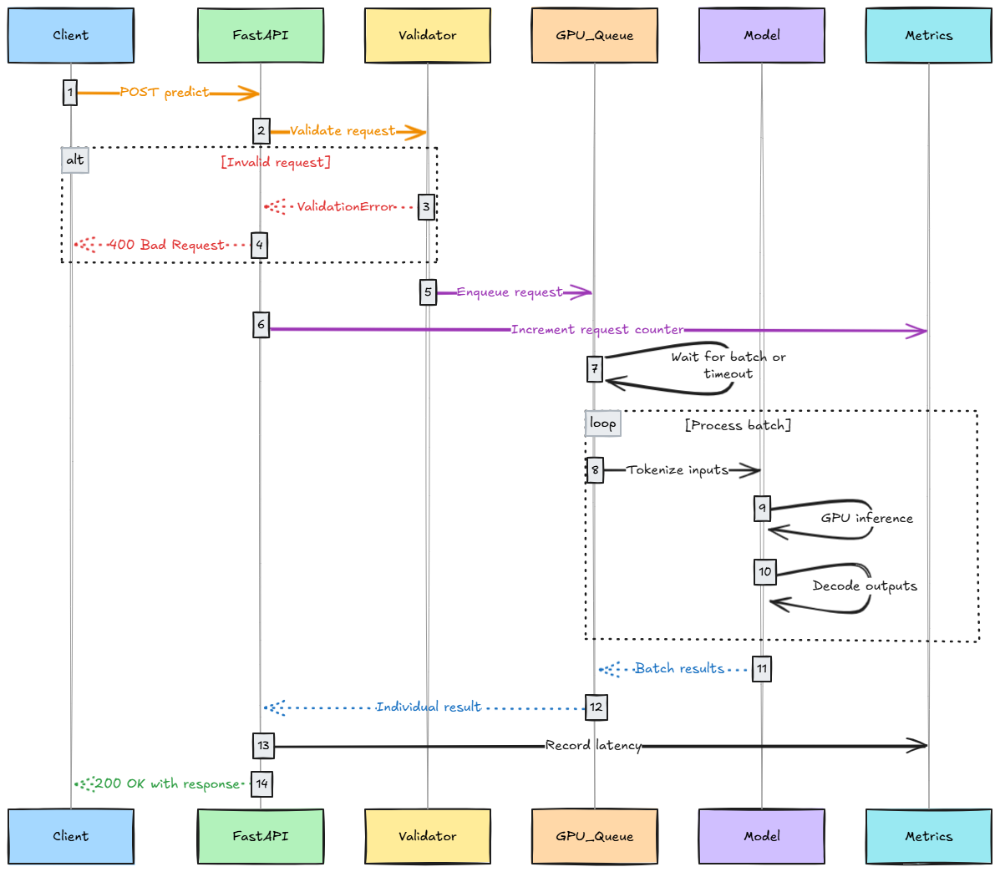
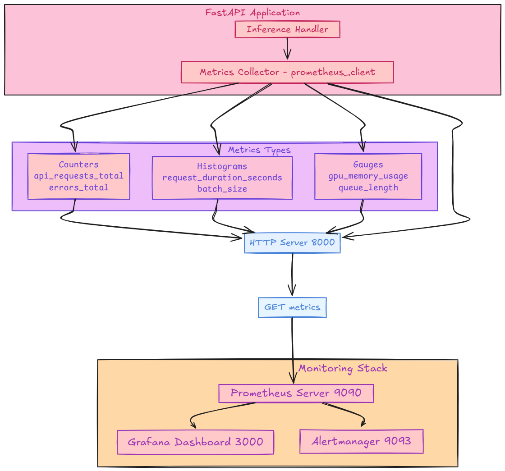
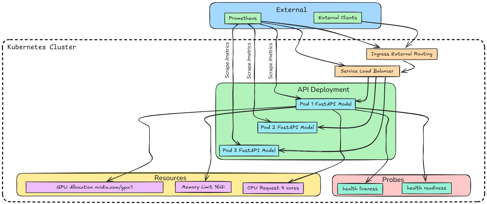

# CustomLLM Inference API

A production-ready FastAPI-based inference service for custom fine-tuned Large Language Models (LLMs) with MLflow integration, GPU batching, and comprehensive monitoring capabilities.


## 🚀 Features

- **FastAPI Framework**: High-performance async API with automatic OpenAPI documentation
- **MLflow Integration**: Seamless model loading and version management from MLflow registry
- **GPU Batching**: Efficient GPU utilization with asynchronous request batching
- **LoRA Adapter Support**: Dynamic loading and switching of LoRA adapters
- **Bearer Token Authentication**: Secure API access with configurable API keys
- **Prometheus Metrics**: Built-in metrics collection for monitoring and observability
- **Health Checks**: Kubernetes-ready liveness and readiness probes
- **Comprehensive Error Handling**: Structured error responses with proper HTTP status codes
- **Request Validation**: Pydantic-based request/response validation
- **Docker Support**: Production-ready containerization with Docker Compose

## 📋 API Endpoints

### Core Endpoints



| Endpoint | Method | Description | Authentication |
|----------|--------|-------------|----------------|
| `/predict` | POST | Main text generation endpoint | Required |
| `/predict/batch` | POST | Batch text generation | Required |
| `/health` | GET | Health check for K8s probes | None |
| `/metrics` | GET | Prometheus metrics | None |
| `/info` | GET | Model metadata from MLflow | None |
| `/status` | GET | Basic service status | None |


### Documentation Endpoints

- **Swagger UI**: `/docs`
- **ReDoc**: `/redoc`
- **OpenAPI Schema**: `/openapi.json`

## 🛠 Installation

### Prerequisites

- Python 3.8+
- CUDA-compatible GPU (recommended)
- MLflow tracking server
- Docker (optional)

### Local Installation

1. **Clone the repository**:
   ```bash
   git clone <repository-url>
   cd CustomLLMFineTuning
   ```

2. **Install dependencies**:
   ```bash
   pip install -r requirements.txt
   ```

3. **Configure environment**:
   ```bash
   cp serving/.env.example serving/.env
   # Edit serving/.env with your configuration
   ```

4. **Set required environment variables**:
   ```bash
   export API_KEY="your-secret-api-key"
   export MODEL_NAME="your-model-name"
   export MLFLOW_TRACKING_URI="http://localhost:5000"
   ```

### Docker Installation

1. **Using Docker Compose** (Recommended):
   ```bash
   cd serving/docker
   docker-compose up -d
   ```

2. **Using Docker directly**:
   ```bash
   docker build -t custom-llm-api -f serving/docker/Dockerfile .
   docker run -p 8000:8000 \
     -e API_KEY="your-secret-api-key" \
     -e MODEL_NAME="your-model-name" \
     -e MLFLOW_TRACKING_URI="http://host.docker.internal:5000" \
     custom-llm-api
   ```

## 🚀 Quick Start

### 1. Start the API Server

**Using the startup script** (Recommended):
```bash
cd serving
python start_api.py --log-level INFO
```

**Using Python module**:
```bash
python -m serving.api.main
```

**Using uvicorn directly**:
```bash
uvicorn serving.api.main:app --host 0.0.0.0 --port 8000
```

### 2. Test the API

**Health Check**:
```bash
curl http://localhost:8000/health
```

**Generate Text**:
```bash
curl -X POST "http://localhost:8000/predict" \
  -H "Authorization: Bearer your-secret-api-key" \
  -H "Content-Type: application/json" \
  -d '{
    "prompt": "Once upon a time",
    "max_length": 100,
    "temperature": 0.7
  }'
```

**Batch Generation**:
```bash
curl -X POST "http://localhost:8000/predict/batch" \
  -H "Authorization: Bearer your-secret-api-key" \
  -H "Content-Type: application/json" \
  -d '{
    "prompts": ["Hello world", "How are you?"],
    "max_length": 50
  }'
```

## 📊 API Usage Examples

### Python Client Example

```python
import requests
import json

# Configuration
API_URL = "http://localhost:8000"
API_KEY = "your-secret-api-key"

headers = {
    "Authorization": f"Bearer {API_KEY}",
    "Content-Type": "application/json"
}

# Single prediction
response = requests.post(
    f"{API_URL}/predict",
    headers=headers,
    json={
        "prompt": "Explain machine learning in simple terms:",
        "max_length": 150,
        "temperature": 0.8,
        "top_p": 0.9
    }
)

result = response.json()
print(f"Generated: {result['generated_text']}")
```

### JavaScript/Node.js Example

```javascript
const axios = require('axios');

const apiClient = axios.create({
  baseURL: 'http://localhost:8000',
  headers: {
    'Authorization': 'Bearer your-secret-api-key',
    'Content-Type': 'application/json'
  }
});

async function generateText(prompt) {
  try {
    const response = await apiClient.post('/predict', {
      prompt: prompt,
      max_length: 100,
      temperature: 0.7
    });
    
    return response.data;
  } catch (error) {
    console.error('API Error:', error.response.data);
  }
}

// Usage
generateText("Write a haiku about programming:")
  .then(result => console.log(result.generated_text));
```

## 🔧 Configuration

### Environment Variables

| Variable | Required | Default | Description |
|----------|----------|---------|-------------|
| `API_KEY` | ✅ | - | Bearer token for authentication |
| `MODEL_NAME` | ⚠️ | `custom-llm` | MLflow model name |
| `MLFLOW_TRACKING_URI` | ⚠️ | `http://localhost:5000` | MLflow server URL |
| `API_HOST` | ❌ | `0.0.0.0` | API server host |
| `API_PORT` | ❌ | `8000` | API server port |
| `API_WORKERS` | ❌ | `1` | Number of worker processes |
| `CUDA_VISIBLE_DEVICES` | ❌ | `0` | GPU device ID |
| `LOG_LEVEL` | ❌ | `INFO` | Logging level |

### Configuration File

The API loads configuration from `Data-Pipeline/configs/serving_config.yaml`:

```yaml
api:
  host: "0.0.0.0"
  port: 8000
  workers: 1

model:
  max_tokens: 2048
  default_max_length: 100
  batch_size: 4

mlflow:
  tracking_uri: "http://localhost:5000"
  model_name: "custom-llm"
  model_stage: "Production"
```

## 📈 Monitoring and Metrics


### Prometheus Metrics

The API exposes the following metrics at `/metrics`:

- `api_requests_total`: Total number of API requests
- `api_request_duration_seconds`: Average request duration
- `gpu_memory_usage_bytes`: Current GPU memory usage
- `tokens_per_second`: Average tokens generated per second
- `model_loaded`: Model loading status (0/1)

### Health Checks

The `/health` endpoint provides comprehensive health information:

```json
{
  "status": "healthy",
  "api_status": "running",
  "model_status": "loaded",
  "gpu_status": "available",
  "timestamp": "2024-01-01T00:00:00Z",
  "uptime_seconds": 3600.0
}
```

### Grafana Dashboard

Use the provided Grafana dashboard configuration in `serving/docker/docker-compose.yml` to visualize metrics.

## 🔒 Security

### Authentication

The API uses Bearer token authentication:

```bash
Authorization: Bearer your-secret-api-key
```

Set the `API_KEY` environment variable to configure the expected token.

### Security Headers

- **CORS**: Configurable cross-origin resource sharing
- **Trusted Hosts**: Host validation middleware
- **Request Size Limits**: Maximum payload size protection

### Production Security Checklist

- [ ] Generate a strong, unique API key
- [ ] Configure CORS origins appropriately
- [ ] Set up HTTPS with SSL certificates
- [ ] Use environment variables for secrets
- [ ] Enable request rate limiting
- [ ] Configure firewall rules
- [ ] Monitor access logs

## 🐛 Troubleshooting

### Common Issues

**1. Model Loading Failed**
```
Error: Model not found in MLflow registry
```
**Solution**: Verify MLflow server is running and model exists:
```bash
curl http://localhost:5000/api/2.0/mlflow/registered-models/get?name=your-model-name
```

**2. GPU Out of Memory**
```
Error: CUDA out of memory
```
**Solutions**:
- Reduce batch size in config
- Use smaller model or quantization
- Clear CUDA cache: `torch.cuda.empty_cache()`

**3. Authentication Failed**
```
Error: 401 Unauthorized - Invalid API key
```
**Solution**: Verify API_KEY environment variable is set correctly.

**4. Connection Refused**
```
Error: Connection refused to MLflow server
```
**Solution**: Ensure MLflow tracking server is accessible:
```bash
curl http://localhost:5000/health
```

### Debug Mode

Enable debug mode for detailed error information:

```bash
export DEBUG=true
python start_api.py --log-level DEBUG
```

### Logs

Check application logs:
```bash
# Container logs
docker logs custom-llm-api

# Local logs
tail -f api.log
```

## 🚀 Deployment

### Kubernetes Deployment


```yaml
apiVersion: apps/v1
kind: Deployment
metadata:
  name: custom-llm-api
spec:
  replicas: 1
  selector:
    matchLabels:
      app: custom-llm-api
  template:
    metadata:
      labels:
        app: custom-llm-api
    spec:
      containers:
      - name: api
        image: custom-llm-api:latest
        ports:
        - containerPort: 8000
        env:
        - name: API_KEY
          valueFrom:
            secretKeyRef:
              name: api-secret
              key: api-key
        resources:
          limits:
            nvidia.com/gpu: 1
        livenessProbe:
          httpGet:
            path: /health
            port: 8000
          initialDelaySeconds: 60
        readinessProbe:
          httpGet:
            path: /health
            port: 8000
          initialDelaySeconds: 30
```

### Production Considerations

- **Resource Limits**: Set appropriate CPU/memory/GPU limits
- **Horizontal Scaling**: Use multiple instances behind a load balancer
- **Model Caching**: Implement distributed model caching
- **Monitoring**: Set up comprehensive monitoring and alerting
- **Backup**: Regular model and configuration backups
- **Updates**: Blue-green deployment for zero-downtime updates

## 📚 API Reference

### Request/Response Schemas

**InferenceRequest**:
```json
{
  "prompt": "string (1-2048 tokens)",
  "max_length": "integer (1-2048, default: 100)",
  "temperature": "float (0.0-2.0, default: 0.7)",
  "top_p": "float (0.0-1.0, default: 0.95)",
  "stop_tokens": ["string"] // optional
}
```

**InferenceResponse**:
```json
{
  "generated_text": "string",
  "prompt": "string",
  "tokens_generated": "integer",
  "processing_time": "float",
  "model_name": "string",
  "model_version": "string",
  "timestamp": "datetime"
}
```

### Error Responses

All errors return a structured error response:

```json
{
  "error": "error_type",
  "message": "Human readable message",
  "details": {},
  "timestamp": "datetime",
  "request_id": "uuid"
}
```

Common error types:
- `validation_error` (400): Invalid request data
- `unauthorized` (401): Missing/invalid API key
- `payload_too_large` (413): Request exceeds size limits
- `service_unavailable` (503): Model not loaded or service unhealthy
- `internal_server_error` (500): Unexpected server error

## 🤝 Contributing

1. Fork the repository
2. Create a feature branch
3. Make your changes
4. Add tests
5. Submit a pull request

## 📄 License

This project is licensed under the MIT License - see the LICENSE file for details.
